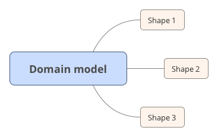
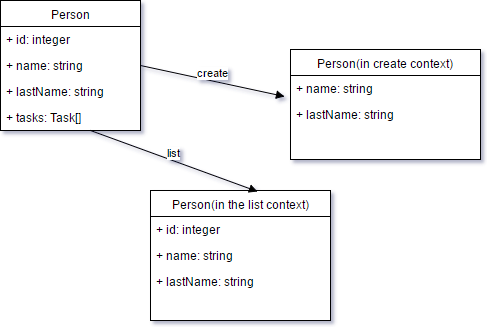

# RAML Typesystem Scopes

### Abstract

Different use cases require us to expose different representations(shapes) of same business entity. 



To highlight a problem let's review following example API:
```raml
#%RAML 1.0
title: "Person api"
mediaType: application/json
types:
  NewPerson:
    properties:
      name: string
      lastName: string
  Person:
    type: NewPerson
    properties:
      id: integer
  DetailedPerson:
    type: Person
    properties:
      tasks: string[]
/people:
  get:
    responses:
      200:
        body: Person[]
  post:
    body:  NewPerson
  /{id}:
    get:
      responses:
        200:
          body: DetailedPerson
```

In this API we have 3 RAML Types describing different shapes of one conceptual business entity. This project is based
on the observation that usually people create different shapes for one business entity when they need to conditionally
hide some entity properties depending from semantical context of type usage. 

For example `id` and `subtasks` properties has no sense for the `Person` which is not created yet. 

We solve this situation by providing a way to mark properties of RAML type as a properties which exist only 
when type is used in an appropriate semantic context, and a tool which allows to get version of RAML type, specialized for particular context of usage. 

As we think this approach allows to describe APIs in a more concise and both more machine and human readable way. For example if your ecosystem supports our tool api above may be rewritten as:

```raml
#%RAML 1.0
title: "Person"
mediaType: application/json
uses:
  core: core.raml
types:
  Person:
    properties:
      id?:
        (core.scopes): create
        type: integer
      name: string
      lastName: string
      tasks?:
        (core.scopes): ["!list", "!create"]
        type: string[]
/people:
  get:
    (core.scopes): list
    responses:
      200:
        body: Person[]
  post:
    (core.scopes): create
    body:  Person
  /{id}:
    get:
      responses:
        200:
          body: Person

```
Basically in this case `Person` type is specialized depending from the roles in the context:



### Specification

### Usage:

Module exports two functions:
    
`specialize(t:Type,scopes:string[]):Type` - gives version of the type with respect to the given scopes

`toShape(obj:any,t:Type,scopes:string[]):any` - cleanups properties of the instance which are not visible
in the given scopes

